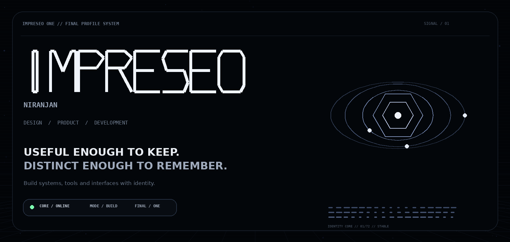
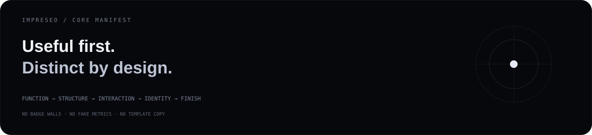
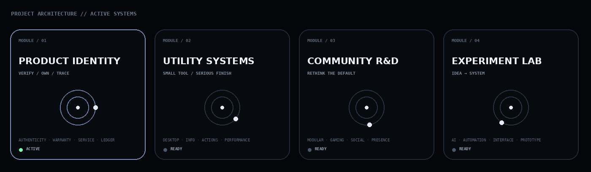
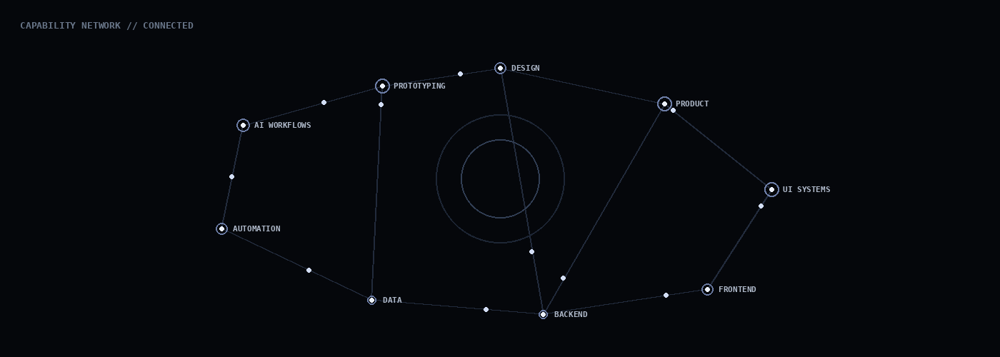

<div align="center">



<br/>

<a href="#-identity"><kbd>IDENTITY</kbd></a>
&nbsp;
<a href="#-projects"><kbd>PROJECTS</kbd></a>
&nbsp;
<a href="#-capabilities"><kbd>CAPABILITIES</kbd></a>
&nbsp;
<a href="#-protocol"><kbd>PROTOCOL</kbd></a>
&nbsp;
<a href="#-telemetry"><kbd>TELEMETRY</kbd></a>
&nbsp;
<a href="#-uplink"><kbd>UPLINK</kbd></a>

</div>


# ◈ IDENTITY

<table>
<tr>
<td width="64%" valign="top">

## `IMPRESEO / NIRANJAN`

I build **software, interfaces, utilities, product systems and experiments**.

Not to make a profile look busy.

To make useful things that feel finished, understandable, and unmistakably intentional.

> **Useful enough to keep. Distinct enough to remember. Finished enough to trust.**

A product is not only its main screen.

It is also its:

`states` · `errors` · `empty screens` · `installation` · `naming` · `performance` · `documentation` · `interaction`

</td>
<td width="36%" valign="top">

```txt
╔═ IMPRESEO::ONE
║
╠ MODE       BUILD
╠ FOCUS      PRODUCT
╠ STYLE      DISTINCT
╠ UI         DARK / CLEAN
╠ BIAS       USEFUL
╠ QUALITY    PRODUCT-GRADE
╠ NOISE      FILTERED
║
╚ STATE      ONLINE
```

**Current lanes**

`desktop utilities`  
`product identity`  
`community systems`  
`automation`  
`AI-assisted workflows`

</td>
</tr>
</table>




# ⌁ PROJECTS

<div align="center">

</div>

<br/>

<details open>
<summary><b>01 // PRODUCT IDENTITY SYSTEM</b></summary>

<br/>

A digital identity layer for physical products.

```txt
PHYSICAL PRODUCT
       │
       ▼
UNIQUE ID / QR / SERIAL
       │
       ▼
VERIFIED DIGITAL RECORD
       │
       ├── authenticity
       ├── manufacturer
       ├── invoice
       ├── warranty
       ├── service history
       ├── ownership ledger
       ├── recalls
       └── lifecycle data
```

**Goal:** keep a product's identity, history and ownership verifiable throughout its lifecycle.

</details>

<details>
<summary><b>02 // UTILITY SYSTEMS</b></summary>

<br/>

Focused desktop tools built around one test:

> **Would this deserve to stay installed?**

```txt
FAST START
LOW BLOAT
CLEAR INFORMATION
REAL ACTIONS
GOOD INSTALL FLOW
CONSISTENT UI
USEFUL DEFAULTS
NO FAKE COMPLEXITY
```

Small scope is fine. Cheap execution is not.

</details>

<details>
<summary><b>03 // COMMUNITY R&D</b></summary>

<br/>

A from-scratch exploration of modern community software built around:

`gaming` · `identity` · `modularity` · `presence` · `customization`

**Rule:** question the default before copying the default.

</details>

<details>
<summary><b>04 // EXPERIMENT LAB</b></summary>

<br/>

```bash
$ idea --spawn
prototype created

$ prototype --test
useful    -> refine
generic   -> rethink
pointless -> delete
```

Automation, AI-assisted workflows, developer utilities, product concepts and interface experiments live here.

</details>


# ✦ CAPABILITIES

<div align="center">

</div>

<br/>

<table>
<tr>
<td width="50%" valign="top">

### `DESIGN / PRODUCT`

```txt
Figma
Photoshop
Illustrator

Information architecture
Interaction thinking
Product structure
Visual systems
Rapid prototyping
```

</td>
<td width="50%" valign="top">

### `BUILD / SYSTEMS`

```txt
HTML / CSS
JavaScript / TypeScript
React
Node.js
Python
SQLite / MySQL

Git / GitHub
Automation
AI-assisted development
```

</td>
</tr>
</table>

> **Tools are replaceable. Taste, structure, problem-solving and execution are the real stack.**


# ⌬ PROTOCOL

<details open>
<summary><b>BUILD PIPELINE</b></summary>

<br/>

```txt
[01] FIND FRICTION
        ↓
[02] REDUCE THE PROBLEM
        ↓
[03] DESIGN THE SYSTEM
        ↓
[04] BUILD THE CORE
        ↓
[05] REMOVE THE GENERIC
        ↓
[06] TEST THE BORING FLOWS
        ↓
[07] SHIP
        ↓
[08] REFINE UNTIL IT FEELS INTENTIONAL
```

</details>

<details>
<summary><b>QUALITY GATE</b></summary>

<br/>

```diff
+ clear hierarchy
+ useful defaults
+ meaningful interaction
+ real states
+ proper error handling
+ responsive behavior
+ fast startup
+ finished installation
+ documentation worth opening
+ motion with purpose
+ visual identity with restraint

- badge walls
- fake skill percentages
- random neon
- feature-count flexing
- template copy
- effects without purpose
- UI made only for screenshots
```

</details>

<details>
<summary><b>DESIGN LANGUAGE</b></summary>

<br/>

```txt
SURFACE      dark / low-noise
TYPE         geometric / technical
MOTION       continuous / restrained
DEPTH        layered / structural
ACCENT       cool neutral
LAYOUT       modular / readable
INTERACTION  native / obvious
IDENTITY     IMPRESEO
```

**Minimal should not mean ordinary.  
Animated should not mean noisy.  
Complex should not mean confusing.**

</details>


# ◉ TELEMETRY

<div align="center">


</div>

<details>
<summary><b>OPEN CONTRIBUTION TRACE</b></summary>

<br/>

<div align="center">
<picture>
  <source media="(prefers-color-scheme: dark)" srcset="https://raw.githubusercontent.com/impreseo/impreseo/output/github-contribution-grid-snake-dark.svg">
  <source media="(prefers-color-scheme: light)" srcset="https://raw.githubusercontent.com/impreseo/impreseo/output/github-contribution-grid-snake.svg">
  
</picture>
</div>

</details>


# ⌘ UPLINK

<div align="center">

### `CHANNEL / OPEN`

**Interesting product, system, utility, interface, or experimental idea?**

<br/>

[](https://github.com/impreseo)
[](https://instagram.com/impreseo)
[](https://linkedin.com/in/impreseo)
[](https://discord.com/users/impreseo)

<br/><br/>


</div>
